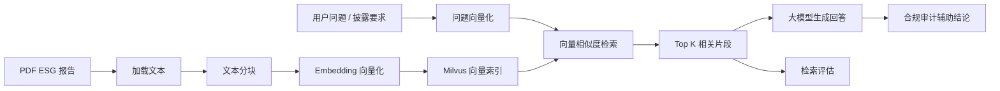
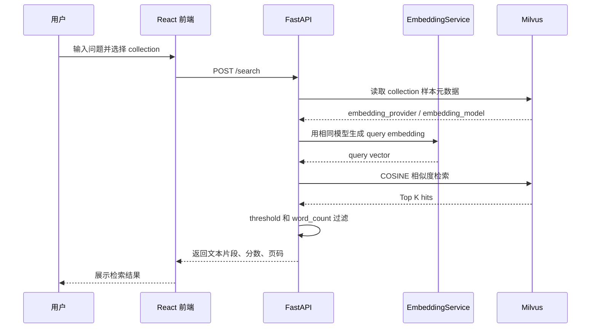
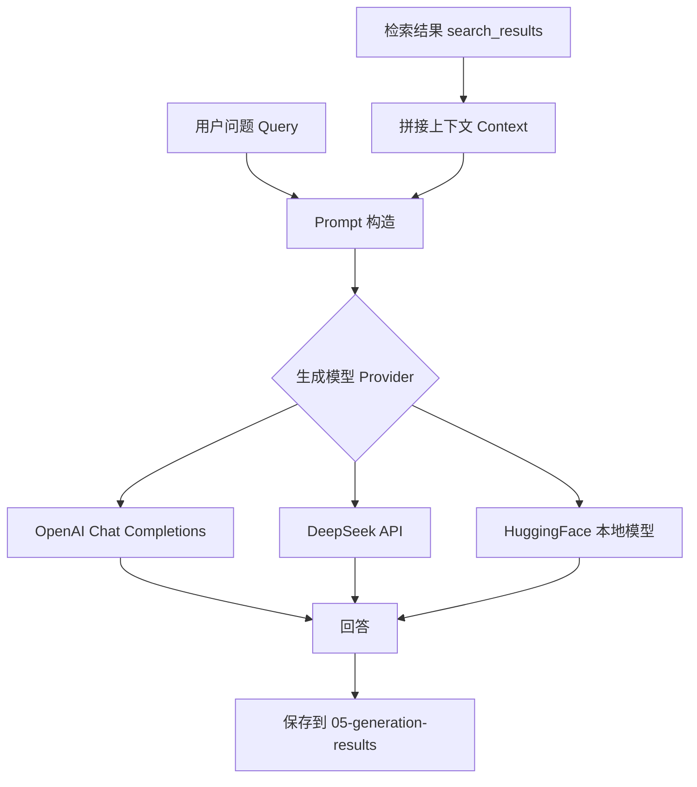
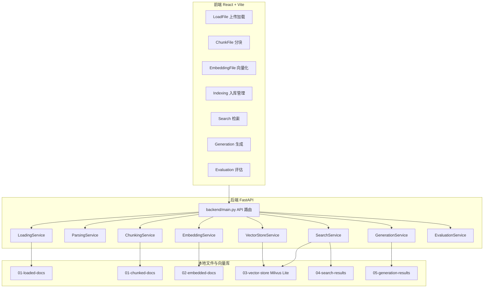
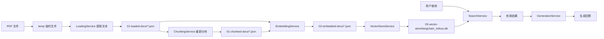

# ESG 合规审计系统业务技术说明

## 1. 项目定位

本项目是一个面向 ESG / 可持续发展报告的 RAG 合规审计系统。它的核心目标是：把 PDF 报告导入系统，经过文本提取、分块、向量化、向量入库后，支持用户用自然语言或披露要求进行相似度检索，再基于检索结果调用大模型生成回答，辅助判断报告是否覆盖了某些合规披露要求。

从代码实现看，它不是一个单纯聊天机器人，而是一个“知识库构建 + 检索 + 生成 + 评估”的完整实验型 RAG 工作台。前端把每个处理步骤拆成页面，后端用 FastAPI 暴露对应接口。

## 2. 项目做了什么

系统主要完成以下事情：

1. 上传 PDF 报告，并用不同 PDF 解析库抽取文本。
2. 将抽取出的文本按页、固定长度、段落或句子切成 chunk。
3. 调用 OpenAI、Bedrock 或 HuggingFace embedding 模型，把 chunk 转成向量。
4. 将向量和 chunk 元数据写入 Milvus 向量库。
5. 用户输入查询问题，系统把问题也转成向量，到 Milvus 中做相似度检索。
6. 将检索命中的上下文交给 OpenAI、DeepSeek 或 HuggingFace 生成模型，生成回答。
7. 可上传带标准页码的 CSV，对检索结果做命中率类评估。

整体业务流程如下：



## 3. 业务逻辑拆解

### 3.1 文档加载

入口接口：`POST /load`

前端页面：`frontend/src/pages/LoadFile.jsx`

后端服务：`backend/services/loading_service.py`

加载阶段负责从 PDF 中抽取文本，并把每页内容保存成标准 JSON。支持的加载方式包括：

- `pymupdf`：速度快，适合普通文本型 PDF。
- `pypdf`：依赖较轻，适合简单 PDF。
- `pdfplumber`：适合需要更细文本位置或表格处理的场景。
- `unstructured`：适合复杂版式，可选 `fast`、`hi_res`、`ocr_only` 策略，也支持 basic / by_title 分块策略。

加载结果保存到：

```text
backend/01-loaded-docs/
```

保存结构大致是：

```json
{
  "filename": "xxx.pdf",
  "total_chunks": 10,
  "total_pages": 10,
  "loading_method": "pymupdf",
  "chunking_method": "loaded",
  "chunks": [
    {
      "content": "页面文本",
      "metadata": {
        "chunk_id": 1,
        "page_number": 1,
        "page_range": "1",
        "word_count": 123
      }
    }
  ]
}
```

### 3.2 文档解析

入口接口：`POST /parse`

前端页面：`frontend/src/pages/ParseFile.jsx`

后端服务：`backend/services/parsing_service.py`

解析阶段更偏“结构化查看”，不是主 RAG 链路的必需步骤。它支持：

- `all_text`：全文按页输出。
- `by_pages`：保留页面边界。
- `by_titles`：用简单规则识别标题并组织成章节。
- `text_and_tables`：用简单启发式区分文本和表格。

这部分主要帮助用户理解 PDF 被抽取出来后的文本结构。

### 3.3 文本分块

入口接口：`POST /chunk`

前端页面：`frontend/src/pages/ChunkFile.jsx`

后端服务：`backend/services/chunking_service.py`

分块阶段从 `01-loaded-docs` 读取加载后的文档，再按用户选择的策略生成新的 chunk 文件。支持：

- `by_pages`：每页一个 chunk。
- `fixed_size`：按固定字符长度切分。
- `by_paragraphs`：按空行段落切分。
- `by_sentences`：用 LangChain 的 `RecursiveCharacterTextSplitter` 按句子与分隔符切分。

分块结果保存到：

```text
backend/01-chunked-docs/
```

业务意义：RAG 检索的基本单位不是整份 PDF，而是 chunk。chunk 太大时检索不够精确，chunk 太小时上下文不完整，所以这个模块允许比较不同分块策略。

### 3.4 Embedding 向量化

入口接口：`POST /embed`

前端页面：`frontend/src/pages/EmbeddingFile.jsx`

后端服务：`backend/services/embedding_service.py`

向量化阶段读取 loaded 或 chunked JSON，把每个 chunk 的 `content` 转成 embedding 向量。支持的 provider：

- `openai`
- `bedrock`
- `huggingface`

实现细节：

- OpenAI embedding 使用批处理，每批 20 条。
- Bedrock 和 HuggingFace 当前逐条处理。
- 每条向量会携带 chunk 元数据，例如页码、chunk_id、word_count、embedding_provider、embedding_model。

向量化结果保存到：

```text
backend/02-embedded-docs/
```

### 3.5 向量入库与索引

入口接口：`POST /index`

前端页面：`frontend/src/pages/Indexing.jsx`

后端服务：`backend/services/vector_store_service.py`

向量入库阶段读取 `02-embedded-docs` 下的 embedding JSON，创建 Milvus collection，并写入向量和元数据。

当前配置位于：

```text
backend/utils/config.py
```

Milvus 使用本地文件 URI：

```text
03-vector-store/langchain_milvus.db
```

支持的索引模式：

- `flat`
- `ivf_flat`
- `ivf_sq8`
- `hnsw`

Milvus collection 字段包括：

- `content`：chunk 文本。
- `document_name`：来源文档。
- `chunk_id`：chunk 编号。
- `word_count`：词数。
- `page_number` / `page_range`：页码信息。
- `embedding_provider` / `embedding_model`：向量模型信息。
- `vector`：向量字段。

### 3.6 检索

入口接口：`POST /search`

前端页面：`frontend/src/pages/Search.jsx`

后端服务：`backend/services/search_service.py`

检索阶段的逻辑是：

1. 用户选择 Milvus collection。
2. 用户输入 query。
3. 系统从 collection 中读取一条样本，拿到当初建库用的 `embedding_provider` 和 `embedding_model`。
4. 用相同 embedding 模型把 query 转为向量。
5. 到 Milvus 中按 COSINE 相似度检索。
6. 用 `threshold` 过滤低分结果。
7. 用 `word_count_threshold` 过滤过短 chunk。
8. 返回命中文本、分数和页码等元数据。

检索结果可以保存到：

```text
backend/04-search-results/
```

检索流程如下：



### 3.7 生成回答

入口接口：`POST /generate`

前端页面：`frontend/src/pages/Generation.jsx`

后端服务：`backend/services/generation_service.py`

生成阶段把检索结果拼接成 context，再让大模型基于 context 回答 query。支持：

- HuggingFace 本地模型：
  - `Llama-2-7b-chat`
  - `DeepSeek-7b`
  - `DeepSeek-R1-Distill-Qwen`
- OpenAI：
  - `gpt-3.5-turbo`
  - `gpt-4`
- DeepSeek：
  - `deepseek-v3`
  - `deepseek-r1`

生成结果保存到：

```text
backend/05-generation-results/
```

RAG 生成逻辑如下：



### 3.8 检索评估

入口接口：`POST /evaluate`

前端页面：`frontend/src/pages/Evaluation.jsx`

后端服务：`backend/services/evaluation_service.py`

评估阶段上传 CSV，CSV 需要包含类似字段：

- `ID`
- `Disclosure Requirement`
- `Corresponding Text`
- `Page Number`
- `Compliance Status`

系统把每行的 `ID + Disclosure Requirement + Corresponding Text` 拼成查询文本，调用检索服务，然后比较检索到的页码与 CSV 中标注的期望页码。

当前评估指标：

- `score_hit`：检索结果中命中期望页码的比例。
- `score_find`：期望页码被找回的比例。

## 4. 技术架构



## 5. 代码目录说明

```text
backend/
├── main.py                         FastAPI 入口，定义所有接口
├── services/
│   ├── loading_service.py          PDF 加载、文本抽取、保存 loaded 文档
│   ├── parsing_service.py          PDF 解析结构化展示
│   ├── chunking_service.py         chunk 切分策略
│   ├── embedding_service.py        embedding provider 封装
│   ├── vector_store_service.py     Milvus 建 collection、插入向量、管理集合
│   ├── search_service.py           query embedding、Milvus 检索、保存检索结果
│   ├── generation_service.py       调用 OpenAI / DeepSeek / HuggingFace 生成回答
│   └── evaluation_service.py       CSV 批量检索评估
├── utils/
│   └── config.py                   Milvus 和索引参数配置
├── 01-loaded-docs/                 加载后的文档 JSON
├── 01-chunked-docs/                分块后的文档 JSON
├── 02-embedded-docs/               embedding 结果 JSON
├── 03-vector-store/                Milvus Lite 本地向量库文件
├── 04-search-results/              保存的检索结果
└── 05-generation-results/          保存的生成结果

frontend/
├── src/App.jsx                     前端路由
├── src/config/config.js            后端 API 地址配置
├── src/components/Sidebar.jsx      左侧导航
└── src/pages/
    ├── LoadFile.jsx                文档加载页面
    ├── ParseFile.jsx               文档解析页面
    ├── ChunkFile.jsx               文档分块页面
    ├── EmbeddingFile.jsx           向量化页面
    ├── Indexing.jsx                向量入库和 collection 管理
    ├── Search.jsx                  检索页面
    ├── Generation.jsx              生成回答页面
    └── Evaluation.jsx              检索评估页面
```

## 6. API 与业务动作对应关系

| 业务动作 | 前端页面 | 后端接口 | 后端服务 | 输出位置 |
|---|---|---|---|---|
| 上传并加载 PDF | LoadFile | `POST /load` | LoadingService | `01-loaded-docs` |
| 解析 PDF 内容 | ParseFile | `POST /parse` | ParsingService | 接口返回 |
| 对已加载文档分块 | ChunkFile | `POST /chunk` | ChunkingService | `01-chunked-docs` |
| 创建 embedding | EmbeddingFile | `POST /embed` | EmbeddingService | `02-embedded-docs` |
| 向量入库 | Indexing | `POST /index` | VectorStoreService | `03-vector-store` |
| 查看 / 删除 collection | Indexing | `GET/DELETE /collections/...` | VectorStoreService | Milvus |
| 相似度检索 | Search | `POST /search` | SearchService | 接口返回 |
| 保存检索结果 | Search | `POST /save-search` | SearchService | `04-search-results` |
| 基于检索结果生成回答 | Generation | `POST /generate` | GenerationService | `05-generation-results` |
| 批量评估检索效果 | Evaluation | `POST /evaluate` | EvaluationService | 接口返回 |

## 7. 数据流转



## 8. 合规审计业务视角

在 ESG 审计场景中，可以把系统理解成以下工作方式：

1. 审计人员上传企业 ESG / Sustainability Report。
2. 系统把报告拆成带页码的知识片段。
3. 审计人员输入披露要求，例如“公司是否披露温室气体排放范围一和范围二数据？”。
4. 系统检索报告中最相关的页面和片段。
5. 大模型基于检索片段生成解释性回答。
6. 审计人员根据命中页码、原文片段和模型回答判断披露是否充分。
7. 如果有标准答案 CSV，可以批量评估检索策略是否能找到正确页面。

也就是说，本项目更像一个“审计辅助检索与问答系统”，不是自动给出法律意义上最终合规结论的系统。

## 9. 当前实现需要注意的点

1. README 中写的是原项目或早期项目说明，部分端口和 Python 版本描述与当前代码可能不完全一致。当前前端配置默认后端地址是 `http://localhost:8000`。
2. `requirements_mac.txt` 中固定的 `torch==2.4.0` 在当前 Intel Mac `osx-64` 平台不可用，实际环境中安装的是 `torch==2.2.2`、`torchvision==0.17.2`、`torchaudio==2.2.2`。
3. 项目说明强调“无框架依赖”，但当前代码实际使用了 LangChain 的 embedding 封装和 `RecursiveCharacterTextSplitter`。
4. Milvus 当前配置为本地 Lite 文件形式，适合本地演示；生产环境通常需要独立 Milvus 服务、权限、备份和容量规划。
5. `by_titles` 和 `text_and_tables` 解析逻辑偏启发式，复杂 ESG 报告中的图表、跨页表格、脚注可能无法稳定识别。
6. 生成阶段依赖外部 API Key 或本地 HuggingFace 模型资源；本地大模型可能对机器显存和内存要求较高。
7. 系统保存了大量中间 JSON，利于调试和教学，但长期运行需要增加文件清理、版本管理和数据权限控制。

## 10. 一句话总结

这个项目把 ESG 报告合规审计拆成一条可视化 RAG 流水线：PDF 进来，文本抽取和分块，向量化入库，问题检索相关原文，再由大模型基于原文生成回答，并支持用标准页码数据评估检索效果。
